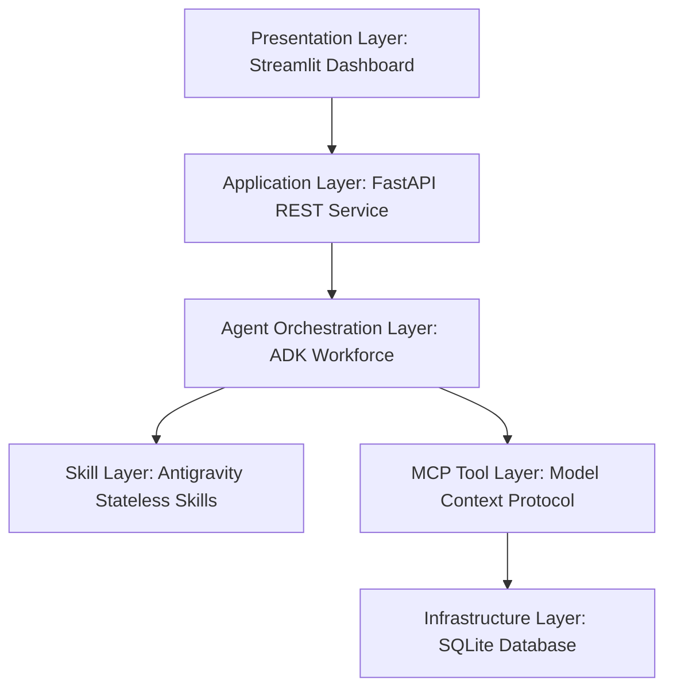
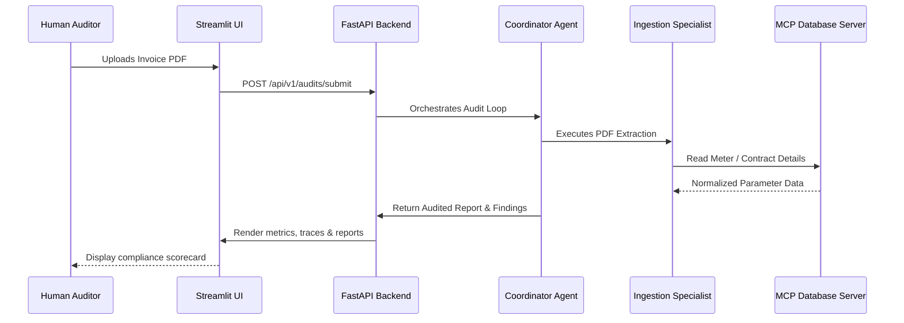

# VoltAudit AI ⚡🔍

[](https://github.com/voltaudit-ai/voltaudit/actions/workflows/ci.yml)
[](https://semgrep.dev/)
[](https://github.com/pre-commit/pre-commit)
[](https://www.python.org/)
[](LICENSE)

VoltAudit AI is a production-grade, enterprise-ready AI Agentic platform for intelligent utility invoice auditing. By coordinating a specialized workforce of 8 cooperative AI agents using the Model Context Protocol (MCP) and Antigravity Skills, it automates ingestion, verification, anomaly detection, compliance scoring, and reporting of multi-million dollar corporate utility expenses.

---

## 📖 Table of Contents
- [Problem Statement](#-problem-statement)
- [Why Agentic AI & MCP?](#-why-agentic-ai--mcp)
- [Enterprise Architecture](#-enterprise-architecture)
- [System Features](#-system-features)
- [Getting Started](#-getting-started)
- [Local Container Development](#-local-container-development)
- [Production Deployment](#-production-deployment)
- [AI Evaluation & Quality Gates](#-ai-evaluation--quality-gates)
- [Future Roadmap](#-future-roadmap)

---

## 🔍 Problem Statement

Large enterprises process thousands of complex utility invoices monthly (electricity, gas, water). Traditional auditing relies on rule-based scripting or manual sampling, leading to major leaks:
- **Rate & Tariff Errors:** Charging peak rates during off-peak windows or violating contracted rate limits.
- **Ingestion Failures:** Typographical mismatches, misread characters, or missing details in PDF invoices.
- **Physical Meter Discrepancies:** Invoice quantities deviating from actual plant meter readings.
- **Double Billing:** Historical duplicate runs bypassing billing systems.

---

## 🤖 Why Agentic AI & MCP?

Traditional RPA (Robotic Process Automation) breaks when document layouts change or vendor rates float dynamically. VoltAudit AI solves this through a layered, decoupled Agentic architecture:

- **Why AI Agents?** Rather than single-prompt completions, we run **8 specialized agents** acting as domain experts (Ingestion, Contracts, Tariff, Reconciler, Risk, etc.) collaborating to resolve anomalies.
- **Why Model Context Protocol (MCP)?** Under a Zero-Trust security model, LLM agents must not have raw database connections or host access. MCP provides bounded, schema-validated stdio tool execution.
- **Why ADK (Agent Development Kit)?** Provides the orchestrator loop, prompt injection guards, and strict tool execution policy validations.
- **Why Antigravity Skills?** Packs complex math calculations, fuzzy string matching, and date comparisons as stateless, decorated packages with automatic telemetry.

---

## 🏗️ Enterprise Architecture

VoltAudit AI isolates components into a 6-layered, decoupled structure:



### Sequence Flow of an Invoice Audit


---

## 🚀 Getting Started

Ensure you have **Python 3.12+** and the fast Python package installer [uv](https://github.com/astral-sh/uv) configured.

### 1. Clone & Install Dependencies
```bash
git clone https://github.com/voltaudit-ai/voltaudit.git
cd voltaudit
uv sync
uv run pre-commit install
```

### 2. Configure Environment Variables
```bash
cp .env.example .env
# Set database paths and log configurations
```

### 3. Run FastAPI Application
```bash
cd backend
uv run uvicorn voltaudit_backend.main:app --host 0.0.0.0 --port 8000
```

### 4. Run Streamlit Frontend
```bash
cd frontend
uv run streamlit run app.py --server.port=8501
```

---

## 🐳 Local Container Development

Build and run all services locally inside isolated containers:
```bash
docker compose -f deploy/docker-compose.yml up --build
```
- **Backend Service:** `http://localhost:8000/health`
- **Frontend Dashboard:** `http://localhost:8501`

---

## 🛡️ AI Evaluation & Quality Gates

We enforce zero-compromise quality standards before code integrates:
- **Programmatic Scorecard Evaluation:** Runs assertions checking compliance score calculations.
- **Path Traversal Guards:** Verifies that path traversal attempts raise standard FileNotFoundError.
- **Ruff & Mypy:** Strictly validates type declarations and code formatting.

Run the test suite locally:
```bash
uv run pytest
```

---

## ⚖️ License

Distributed under the MIT License. See [LICENSE](LICENSE) for more details.
