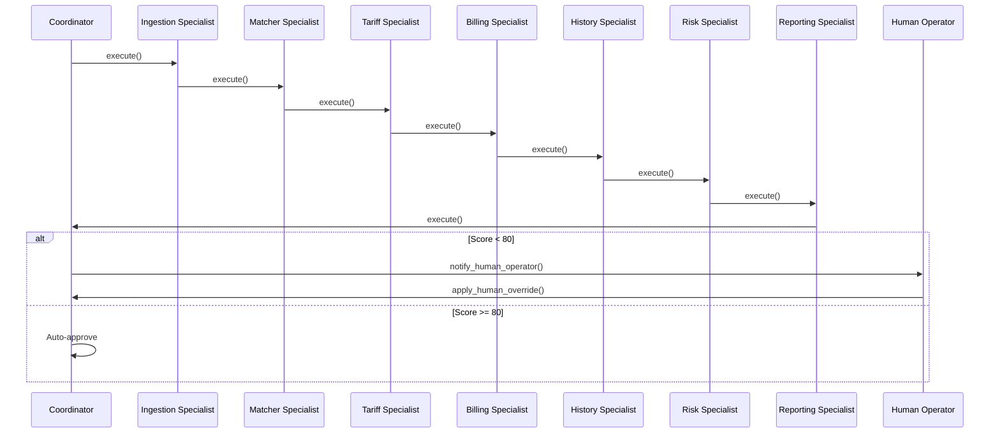

# 💼 VoltAudit AI Enterprise Business Agents

This document defines the roles, responsibilities, guardrails, and lifecycle collaboration models for the **Enterprise AI Workforce** of VoltAudit AI.

---

## 1. Business Workforce Profiles

The workforce consists of 8 specialized business agents coordinated by an Executive Coordinator:

* **Executive Audit Coordinator (WRK-001):** Supervises the audit workflow execution, checks compliance score thresholds, escalates anomalies, and manages the Human-in-the-Loop gateway.
* **Document Ingestion Specialist (WRK-002):** Ingests raw files, extracts text layout blocks, and validates data structures.
* **Vendor & Contract Specialist (WRK-003):** Resolves raw vendor strings against canonical records and checks contract coverage date overlays.
* **Tariff Validation Specialist (WRK-005):** Validates seasonal peaking tariff hours and time-of-use rate multipliers.
* **Billing & 3-Way Match Specialist (WRK-006):** Recalculates arithmetic line totals and cross-references them with generation plant meter records.
* **Historical Anomaly Specialist (WRK-007):** Scans historical invoice submissions to identify double-billing attempts.
* **Risk Assessment Specialist (WRK-008):** Weights detected discrepancy severities and computes final compliance scores.
* **Audit Reporting Specialist (WRK-008_reporter):** Formulates human-readable markdown summaries.

---

## 2. Hardened Security Guardrails

The platform implements 3 runtime security guardrails inside the base `ADKAgent` execution pipeline:

1. **Prompt Injection Resistance:** Scans raw text blocks for malicious instruction-override keywords. Aborts execution immediately, zeroing out compliance scores if detected.
2. **MCP Tool Authorization:** Restricts agent operations to their explicit `allowed_mcp_tools` lists. Raises permission exceptions on unauthorized calls.
3. **Resilient DB Closures:** Restructures SQLite transaction handlers using `try...finally` blocks to guarantee database connection releases under exceptions.

---

## 3. Collaboration & Lifecycle Management

### Specialist Retries & Failures
If a specialist encounters a transient failure (e.g. SQLite locks, network delays), the base execution wrapper retries up to 3 times with exponential backoffs before raising error events.
