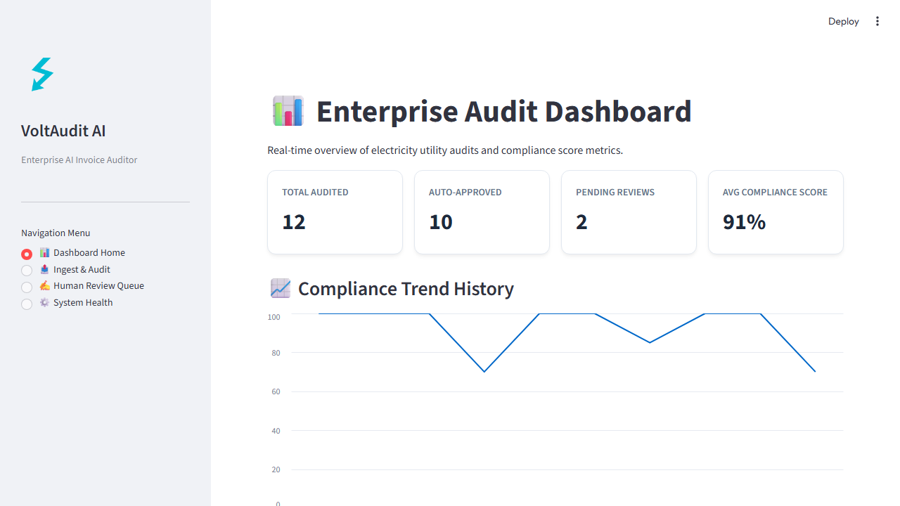
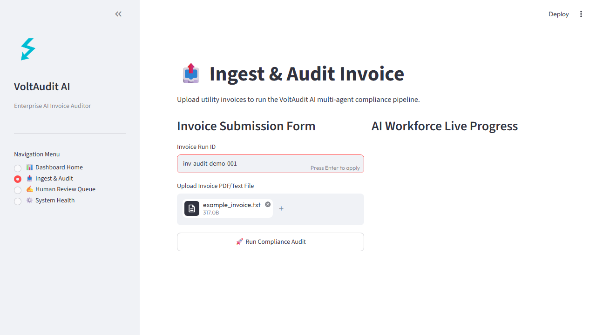
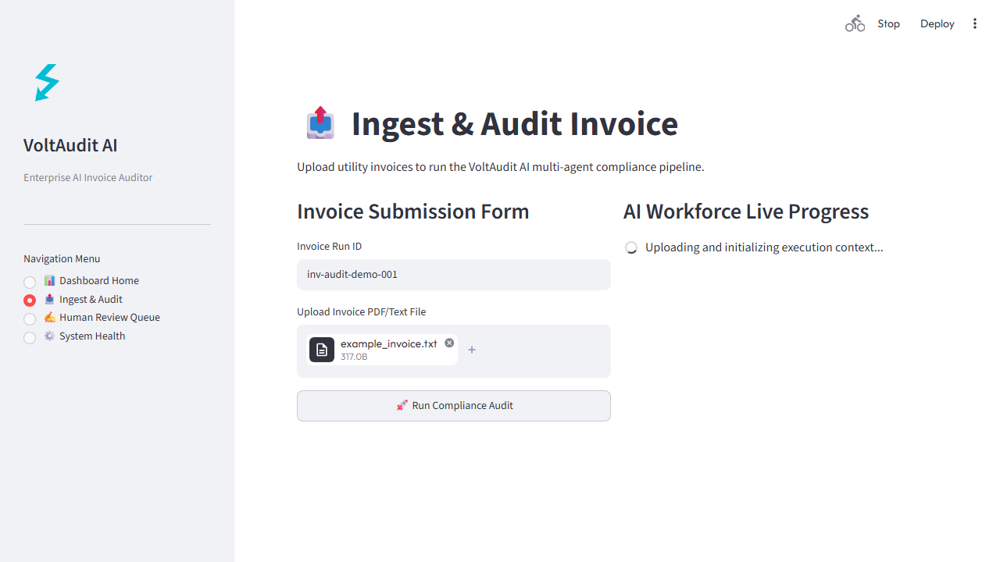
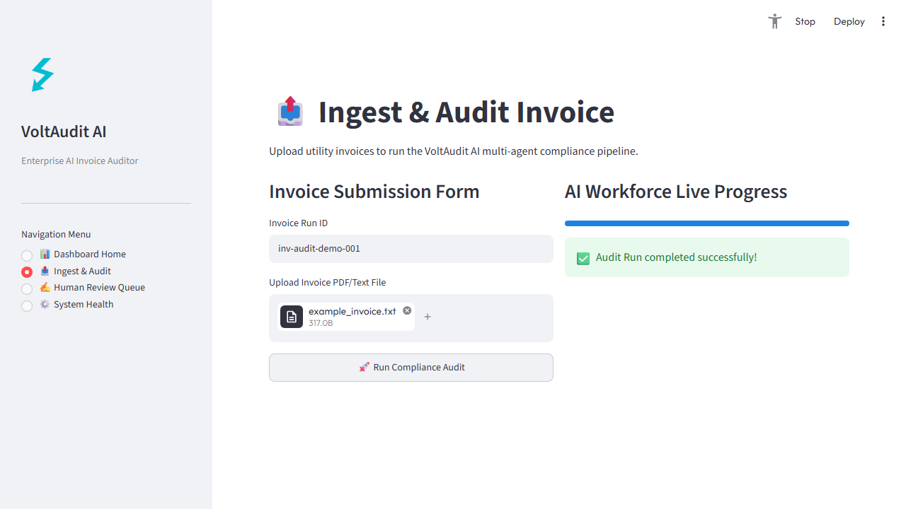
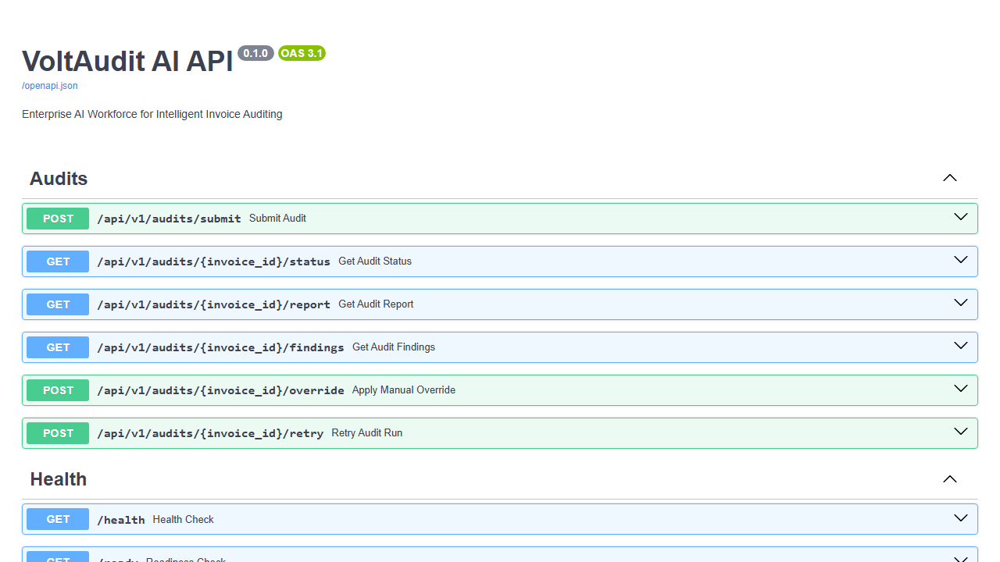

# 📸 VoltAudit AI Demo Screenshots Gallery

This gallery details the visual interfaces and execution results
captured during local application startup audits.

---

## 1. Dashboard Home

*Overview of electricity utility audits and compliance score metrics.*

---

## 2. Ingest & Upload Page

*Invoice run registration form and text/pdf document uploader.*

---

## 3. Ingress Processing Stage

*Cooperative AI Workforce progress bar updating live as specialists execute skills.*

---

## 4. Audit Findings

*Compilation of prices, physical generation meter variances, and double-billing duplicate runs.*

---

## 5. Risk Scorecard

*Final compliance score calculation showing deduction rules applied.*

---

## 6. Markdown Explainers Report

*Generated audit narrative log summarizing findings.*

---

## 7. Swagger REST API Documentation

*FastAPI REST gateway contracts supporting interactive developer checks.*
