# 🤖 Enterprise AI Workforce Design

This document details the organizational design, specialized worker profiles, governance rules, and traceability mappings for the **VoltAudit AI** Enterprise AI Workforce.

---

## 1. Workforce Organization & Hierarchy

The AI Workforce mirrors a professional corporate utility audit department. It separates oversight, document processing, mathematical calculation, and fraud analysis among specialized workers.

```mermaid
graph TD
    Human["Human Audit Supervisor (Sign-off)"] <--> Exec["Executive Audit Coordinator"]

    subgraph Specialists ["Specialist Audit Workers"]
        Exec --> Ingest["Document Ingestion Specialist"]
        Exec --> Resolv["Vendor Resolution Specialist"]
        Resolv --> Contract["Contract & PO Matcher"]
        Contract --> Tariff["Tariff Validation Auditor"]
        Contract --> Meter["Meter Reconciliation Auditor"]
        Tariff --> Anomaly["Historical Anomaly Analyst"]
        Meter --> Anomaly
        Anomaly --> Reporter["Risk & Report Compiler"]
    end

    Reporter --> Exec

    style Human fill:#ffeb3b,stroke:#333,stroke-width:2px
    style Exec fill:#ff9800,stroke:#333,stroke-width:2px
    style Specialists fill:#121a2b,stroke:#26375c,stroke-width:1px
```



### Worker Roles
1. **Executive Audit Coordinator:** Enforces the audit workflow, handles job routing, and compiles final audit reports for human sign-off.
2. **Document Ingestion Specialist:** Classifies incoming invoice streams and extracts raw transaction metadata.
3. **Vendor Resolution Specialist:** Normalizes raw supplier details and verifies vendor compliance profiles.
4. **Contract & PO Matcher:** Resolves governing contract rate sheets and maps billing line items to Purchase Orders.
5. **Tariff Validation Auditor:** Recalculates billed rates against active utility tariff tiers and multipliers.
6. **Meter Reconciliation Auditor (3-Way Matcher):** Reconciles billed generation totals against actual plant meter output logs.
7. **Historical Anomaly Analyst:** Analyzes billing histories to identify duplicate invoices or double-billing velocities.
8. **Risk & Report Compiler:** Aggregates warnings, scores compliance risk, and writes explainable summaries.

---

## 2. Worker Catalog & Profiles

### 1. Executive Audit Coordinator
* **Mission:** Supervise the audit lifecycle, orchestrate specialized worker handoffs, and manage the human review gateway.
* **Business Purpose:** Provide a unified operational control point ensuring all invoices pass configured audit gates.
* **Owned Capability:** Human Review & Governance.
* **Responsibilities:**
  - Initialize the audit pipeline when an invoice is submitted.
  - Route intermediate outputs between specialists.
  - Handle exceptions and route high-risk findings to the Human Supervisor.
* **Business Inputs:** Ingestion triggers, final reports from the Risk & Report Compiler, human override actions.
* **Business Outputs:** Dispatched audit requests, approved audit records, vendor dispute records.
* **Dependencies:** Document Ingestion Specialist, Risk & Report Compiler.
* **Upstream Workers:** Human Audit Supervisor.
* **Downstream Workers:** Document Ingestion Specialist.
* **Human Collaboration Points:** Direct portal interface for reviews, overrides, and final approval sign-offs.
* **Decision Authority:** Can mark an invoice as "Clear to Pay" if the risk score is Low. Cannot override Warnings without human sign-off.
* **Escalation Conditions:** Escalate to human supervisor if risk score is High, or if a duplicate invoice anomaly is flagged.
* **Security Boundary:** Trusted Coordinator. Exposes APIs to the frontend and acts as the gatekeeper to the ERP gateway.
* **Trust Level:** High.
* **Explainability Requirements:** Must log the complete lineage of worker handoffs and human overrides.
* **Observability Requirements:** Trace execution timings and worker failures.
* **Success Metrics (KPIs):** Pipeline throughput, SLA compliance (audits completed within 5 minutes of ingestion).
* **Failure Conditions:** Hand-off timeout, database connection loss, LLM provider exhaustion.
* **Recovery Strategy:** Retry transient failures; persist pipeline state to database and flag runs as "SUSPENDED" for human operator visibility.

### 2. Document Ingestion Specialist
* **Mission:** Ingest raw files and extract structured line item grids and headers.
* **Business Purpose:** Translate incoming document formats into standard machine-readable data payloads.
* **Owned Capability:** Invoice Capture & Parsing.
* **Responsibilities:**
  - Classify uploaded files (Invoice vs Credit Note vs utility billing).
  - Extract text coordinates and run table OCR grid alignments.
* **Business Inputs:** Raw PDF or image files.
* **Business Outputs:** Structured invoice metadata (raw vendor name, date, billed total, line item grids).
* **Dependencies:** None.
* **Upstream Workers:** Executive Audit Coordinator.
* **Downstream Workers:** Vendor Resolution Specialist.
* **Human Collaboration Points:** None.
* **Decision Authority:** Can reject unreadable or corrupt documents automatically.
* **Escalation Conditions:** Escalate if document type cannot be classified, or if total billed math is unextractable.
* **Security Boundary:** Low-trust sandbox. Handles potentially hostile file formats. No direct network or DB access.
* **Trust Level:** Low.
* **Explainability Requirements:** Must highlight the spatial coordinates (bounding boxes) on the PDF for every extracted text block.
* **Observability Requirements:** OCR confidence metrics per line item.
* **Success Metrics (KPIs):** Extraction F1-score (`>99%`), OCR character error rate (`<1%`).
* **Failure Conditions:** Blurred images, encrypted PDFs, missing line-item tables.
* **Recovery Strategy:** Reject file, flag status as `FAILED_INGESTION`, and request the human operator to upload a high-resolution version.

### 3. Vendor Resolution Specialist
* **Mission:** Standardize supplier names and verify vendor registration compliance.
* **Business Purpose:** Prevent payment fraud by ensuring bills correspond to canonical approved suppliers.
* **Owned Capability:** Vendor Identification & Resolution.
* **Responsibilities:**
  - Execute Jaro-Winkler/Levenshtein matching algorithms to resolve suppliers.
  - Query tax ID compliance status.
* **Business Inputs:** Raw vendor name string, tax ID.
* **Business Outputs:** Canonical Vendor ID, supplier tax registration status.
* **Dependencies:** Document Ingestion Specialist.
* **Upstream Workers:** Document Ingestion Specialist.
* **Downstream Workers:** Contract & PO Matcher.
* **Human Collaboration Points:** Prompts operator to map new vendor variations to existing profiles.
* **Decision Authority:** Matches vendor profiles if similarity score is `>95%`.
* **Escalation Conditions:** Similarity score `<95%` (unresolved vendor) or tax ID mismatches database profiles.
* **Security Boundary:** Read-only access to Supplier Master Data.
* **Trust Level:** Medium.
* **Explainability Requirements:** Provide the similarity matching score and historical spelling variants used for the decision.
* **Observability Requirements:** Log mapping outcomes and new vendor string occurrences.
* **Success Metrics (KPIs):** Vendor resolution accuracy (`100%` on matches), Zero false-positive supplier mappings.
* **Failure Conditions:** Supplier name completely absent, duplicate tax IDs in master records.
* **Recovery Strategy:** Route to a manual mapping queue; suspend the audit run until the vendor is resolved.

### 4. Contract & PO Matcher
* **Mission:** Map transaction line items to active contractual rate agreements and Purchase Orders.
* **Business Purpose:** Identify the governing financial ruleset and authorized budgets for the invoice billing period.
* **Owned Capability:** Contract & Agreement Intelligence.
* **Responsibilities:**
  - Retrieve active governing contracts matching the billing cycle.
  - Reconcile invoice line items to Purchase Order (PO) line items.
* **Business Inputs:** Canonical Vendor ID, invoice date, line items list.
* **Business Outputs:** Contract ID, PO ID, active tariff multipliers and rate sheets.
* **Business Rules:** Contract must be active on the invoice date.
* **Dependencies:** Vendor Resolution Specialist.
* **Upstream Workers:** Vendor Resolution Specialist.
* **Downstream Workers:** Tariff Validation Auditor, Meter Reconciliation Auditor.
* **Human Collaboration Points:** None.
* **Decision Authority:** Binds contract rates to invoice items.
* **Escalation Conditions:** No active contract found for the billing date, or PO balance is exhausted.
* **Security Boundary:** Read-only access to Contracts and Procurement databases.
* **Trust Level:** Medium.
* **Explainability Requirements:** Cite the contract document ID, rate sheet table index, and PO number used for alignment.
* **Observability Requirements:** Log query matches and missing contract events.
* **Success Metrics (KPIs):** Contract match accuracy (`100%`), Zero missing rate-sheet alignments.
* **Failure Conditions:** Missing active contracts, multiple active contracts for the same date range (conflict).
* **Recovery Strategy:** Flag status as `MISSING_AGREEMENT`, halt validation, and notify the Contract Management team.

### 5. Tariff Validation Auditor
* **Mission:** Verify that billed utility charges conform to contractual rates and regulatory tariff rules.
* **Business Purpose:** Eliminate utility overbilling caused by incorrect peak pricing, seasonal multipliers, or capacity adjustments.
* **Owned Capability:** Tariff & Charge Validation.
* **Responsibilities:**
  - Recalculate capacity charges, variable energy charges, and tax rates.
  - Verify that peak/off-peak billing hours match regional utility calendars.
* **Business Inputs:** Invoice line items, contractual rate sheet rules, calendar definitions.
* **Business Outputs:** Tariff audit log, list of pricing discrepancies.
* **Dependencies:** Contract & PO Matcher.
* **Upstream Workers:** Contract & PO Matcher.
* **Downstream Workers:** Historical Anomaly Analyst.
* **Human Collaboration Points:** None.
* **Decision Authority:** Evaluates pricing compliance.
* **Escalation Conditions:** Discrepancy delta exceeds contract tolerance limits.
* **Security Boundary:** Math sandbox. Read-only access to regulatory tariff catalogs.
* **Trust Level:** Medium.
* **Explainability Requirements:** Provide mathematical breakdowns showing: `Billed Rate` vs `Contractual Rate` and the calculated financial overage.
* **Observability Requirements:** Audit calculation traces.
* **Success Metrics (KPIs):** Recalculation accuracy (`100%`), Zero missed tariff mismatches.
* **Failure Conditions:** Billed rate categories do not exist in the contract rules.
* **Recovery Strategy:** Flag as `PRICE_MISMATCH`, document the delta, and forward to the Risk & Report Compiler.

### 6. Meter Reconciliation Auditor (3-Way Matcher)
* **Mission:** Reconcile billed energy quantities against physical generation meter logs.
* **Business Purpose:** Prevent billing for phantom power or generation deltas exceeding actual output.
* **Owned Capability:** Billing Calculation & 3-Way Match.
* **Responsibilities:**
  - Fetch hourly generation logs from plant meter databases.
  - Summarize metered generation for the billing cycle and compare with invoice quantities.
* **Business Inputs:** Billed invoice quantities, plant meter logs.
* **Business Outputs:** Meter reconciliation logs, quantity variance discrepancies.
* **Business Rules:** Billed quantity must not exceed metered quantity by more than the 0.5% tolerance limit.
* **Dependencies:** Contract & PO Matcher.
* **Upstream Workers:** Contract & PO Matcher.
* **Downstream Workers:** Historical Anomaly Analyst.
* **Human Collaboration Points:** None.
* **Decision Authority:** Confirms physical delivery matches billing.
* **Escalation Conditions:** Billed quantity exceeds meter records by `>0.5%`.
* **Security Boundary:** Read-only access to plant operational databases.
* **Trust Level:** Medium.
* **Explainability Requirements:** Provide total metered generation sums and link to the source meter ID records.
* **Observability Requirements:** Log reconciliation deltas.
* **Success Metrics (KPIs):** Quantity validation coverage (`100%` of line items matched to meter logs).
* **Failure Conditions:** Meter records missing or corrupt for the billing date range.
* **Recovery Strategy:** Flag as `METER_LOGS_MISSING`, suspend calculation, and notify the Plant Operations team.

### 7. Historical Anomaly Analyst
* **Mission:** Scan historical billing records to detect duplicate invoices or velocity anomalies.
* **Business Purpose:** Prevent duplicate payments and identify historic billing discrepancies.
* **Owned Capability:** Anomalies & Historical Analysis.
* **Responsibilities:**
  - Execute duplicate detection routines (same invoice number, or matching billing totals within a 30-day window).
  - Compare current line item rates with historical averages for the vendor.
* **Business Inputs:** Current invoice details, historical invoice database.
* **Business Outputs:** Historical duplicate check log, billing velocity alerts.
* **Dependencies:** Tariff Validation Auditor, Meter Reconciliation Auditor.
* **Upstream Workers:** Tariff Validation Auditor, Meter Reconciliation Auditor.
* **Downstream Workers:** Risk & Report Compiler.
* **Human Collaboration Points:** None.
* **Decision Authority:** Flags duplicate or double-billing indicators.
* **Escalation Conditions:** High-confidence duplicate invoice detected.
* **Security Boundary:** Read-only access to historical invoice tables.
* **Trust Level:** Medium.
* **Explainability Requirements:** Highlight the historical invoice ID, date, and amount that triggered the duplicate warning.
* **Observability Requirements:** Run execution records.
* **Success Metrics (KPIs):** Recall of duplicate submissions (`100%`).
* **Failure Conditions:** Database index corruption preventing historic lookups.
* **Recovery Strategy:** Force index rebuild, raise critical system warning, and block invoice progress.

### 8. Risk & Report Compiler
* **Mission:** Synthesize audit findings, score compliance risk, and write plain-text summaries.
* **Business Purpose:** Present clean, actionable findings to human reviewers, reducing review cognitive load.
* **Owned Capability:** Risk & Compliance Assessment, Audit Reporting.
* **Responsibilities:**
  - Weigh severity metrics and assign a unified Risk Score (0-100).
  - Generate human-readable discrepancy narratives citing contract sections.
* **Business Inputs:** Pricing discrepancies, quantity variances, historical duplicates, contract clauses.
* **Business Outputs:** Final Audit Report document, risk score, recommended audit action.
* **Dependencies:** Historical Anomaly Analyst.
* **Upstream Workers:** Historical Anomaly Analyst.
* **Downstream Workers:** Executive Audit Coordinator.
* **Human Collaboration Points:** None (indirectly writes the report presented to the human reviewer).
* **Decision Authority:** Classifies audit outcomes (Passed, Warning, High Risk).
* **Escalation Conditions:** Compliance Score drops below 80.
* **Security Boundary:** Write-only access to discrepancies and audit-run tables.
* **Trust Level:** Medium.
* **Explainability Requirements:** Provide clear, citation-backed textual explanations of every warning.
* **Observability Requirements:** Report generation logs.
* **Success Metrics (KPIs):** Report accuracy (`100%` mapping of raw errors), explanation utility score.
* **Failure Conditions:** LLM text generation failure or formatting serialization failures.
* **Recovery Strategy:** Regenerate report using deterministic fallback text listing raw discrepancies.

---

## 3. Collaboration & Lifecycle Model

```
 ┌──────────────┐     1. Ingest      ┌──────────────┐
 │ Upload Portal├───────────────────►│ Ingest Spec. │
 └──────────────┘                    └──────┬───────┘
                                            │ 2. Extracted Data
                                            ▼
 ┌──────────────┐     4. Rates       ┌──────────────┐
 │ Contract/PO  │◄───────────────────┤ Vendor Spec. │
 │ Matcher      │                    └──────┬───────┘
 └──────┬───────┘                           │ 3. Canonical Vendor ID
        │                                   ▼
        │ 5. Governing Rates & Rules
        ▼
 ┌──────────────┐     6. Recalculate ┌──────────────┐
 │ Tariff Spec. │◄───────────────────┤ Meter Spec.  │
 └──────┬───────┘                    └──────┬───────┘
        │                                   │ 7. Billed vs Metered
        ▼                                   ▼
 ┌──────────────────────────────────────────────────┐
 │           Historical Anomaly Analyst             │
 └──────────────────────┬───────────────────────────┘
                        │ 8. Audit Findings & Historical Context
                        ▼
 ┌──────────────────────────────────────────────────┐
 │            Risk & Report Compiler                │
 └──────────────────────┬───────────────────────────┘
                        │ 9. Draft Audit Report & Risk Score
                        ▼
 ┌──────────────────────────────────────────────────┐
 │           Executive Audit Coordinator            │
 └──────────────────────┬───────────────────────────┘
                        │ 10. Audit Dashboard Review
                        ▼
 ┌──────────────────────────────────────────────────┐
 │             Human Audit Supervisor               │
 └──────────────────────────────────────────────────┘
```

### Collaboration Workflows
* **Sequential Verification:** Document Capture Specialist -> Vendor Resolution Specialist -> Contract & PO Matcher. This forms the foundational context required before any math checks can occur.
* **Parallel Calculation:** The Contract Rate Sheet is dispatched to both the Tariff Validation Auditor (pricing math) and the Meter Reconciliation Auditor (generation quantity matching) simultaneously.
* **Review Loop:** The Historical Anomaly Analyst combines the pricing and quantity warnings, runs history scans, and passes a unified anomaly log to the Risk & Report Compiler.
* **Escalation Loop:** If any specialist encounters a critical failure condition (e.g. missing contracts, unreadable files), they trigger an immediate escalation path to the Executive Coordinator, halting the pipeline and notifying the operator.

---

## 4. Workforce Governance & Accountability

1. **Separation of Duties:**
   - The worker extracting the invoice text (Document Ingestion Specialist) has no access to the Contract database. This prevents prompt injections in the invoice text from manipulating contract rate selections.
   - The Auditor workers (Tariff, Meter) cannot write report logs or modify invoice statuses; they only output mathematical comparisons.
2. **Accountability Gate:**
   - The AI Workforce is strictly advisory. AI workers cannot make external payments or write journal entries. Only a human supervisor can finalize and authorize transaction postings in the ERP.
3. **Least Privilege System Integration:**
   - Specialized workers only consume the specific MCP tools required for their mission. For example, the Meter Reconciliation Auditor is denied access to the Contract Search tool, and the Vendor Resolution Specialist is denied access to Meter logs.
4. **Traceability Audits:**
   - Every audit report must contain a complete traceability record showing the raw OCR text blocks, the specific contract section UUID, the meter log database ID, and the IDs of the workers that evaluated them.

---

## 5. Master Capability-to-Worker Traceability Matrix

This matrix maps every business capability to its owning AI worker, required skills, MCP tools, and engineering verification tests.

| Approved Business Capability | Owning AI Worker | Future Skill package | Future MCP Tool Group | Future ADK Agent | Future APIs | Future Tests |
| :--- | :--- | :--- | :--- | :--- | :--- | :--- |
| **Invoice Capture & Parsing** | Document Ingestion Specialist | `pdf_text_extractor`, `ocr_table_aligner` | `read_uploaded_file` | `IngestAgent` | `POST /invoices/ingest` | `test_pdf_parsing`, `test_ocr_alignment` |
| **Vendor Identification & Resolution** | Vendor Resolution Specialist | `fuzzy_match_vendor` | `search_canonical_vendors` | `VendorAgent` | `POST /vendors/resolve` | `test_vendor_fuzzy_match` |
| **Contract & Agreement Intelligence** | Contract & PO Matcher | `rate_sheet_lookup_index` | `query_active_contracts`, `query_purchase_orders` | `ContractAgent` | `GET /contracts/active` | `test_contract_lookup`, `test_po_reconciliation` |
| **Tariff & Charge Validation** | Tariff Validation Auditor | `energy_unit_converter` | `lookup_meter_readings` | `TariffAgent` | `POST /audits/validate` | `test_tariff_calculations`, `test_peak_rates` |
| **Billing Calculation & 3-Way Match** | Meter Reconciliation Auditor | `billing_math_calculator` | `lookup_meter_readings` | `MeterAgent` | `POST /audits/calculate` | `test_three_way_match`, `test_meter_deltas` |
| **Anomalies & Historical Analysis** | Historical Anomaly Analyst | `fuzzy_match_vendor` | `query_invoice_history` | `AnomalyAgent` | `GET /invoices/history` | `test_duplicate_invoice`, `test_velocity_alerts` |
| **Risk & Compliance Assessment** | Risk & Report Compiler | `audit_scorer` | `save_audit_run` | `ReportAgent` | `GET /audits/score` | `test_compliance_scoring`, `test_severity_weights` |
| **Audit Reporting** | Risk & Report Compiler | `narrative_generator` | `create_discrepancy_records` | `ReportAgent` | `GET /audits/report` | `test_report_generation`, `test_explanation_narratives` |
| **Human Review & Governance** | Executive Audit Coordinator | `narrative_generator` | `notify_human_operator` | `CoordinatorAgent` | `POST /audits/approve` | `test_human_overrides`, `test_approval_gate` |

---

## 6. Future Mapping Placeholders

* **Future Skill Packages:** Will be defined under `/antigravity-skills/` as stateless python modules implementing standard mathematical and parser interfaces.
* **Future MCP Tool Groups:** Will be implemented in the `/mcp/` package using the Model Context Protocol python SDK, exposing parameterized database wrappers.
* **Future ADK Agents:** Will be implemented in the `/agents/` package using the Google Agent Development Kit (ADK), defining task loops, instructions, and prompt configurations.
* **Future Evaluation Metrics:** Will use pytest assertions matching the success targets in the Traceability Matrix (e.g. F1 metrics, mismatch flags).
* **Future Security Policies:** Will configure Semgrep custom filters and SQLite database transaction authorization parameters.
* **Future UI Components:** Will be built under `/frontend/src/components/` as React console views (e.g. Ingestion Monitor, Discrepancy Alert Board, Approval Sign-off Panel).
