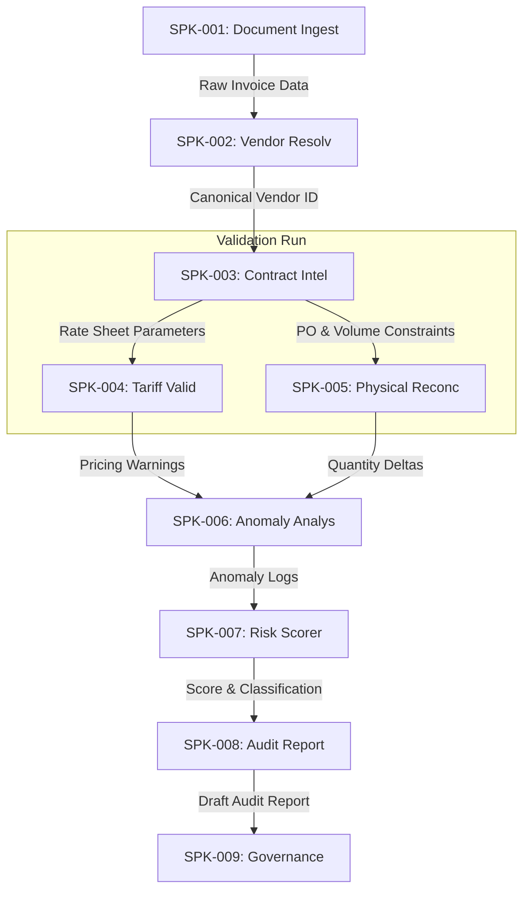

# 🧩 Enterprise Skill Package Architecture

This document defines the Enterprise Skill Package Architecture for **VoltAudit AI**. It establishes the stateless capability structures, internal skill inventories, composition patterns, and governance rules for our AI workforce skills.

---

## 1. Skill Package Catalog

Skill Packages provide reusable business capabilities that multiple workers can consume. They remain stateless, testable, and implementation-independent.

### SPK-001: Document Ingestion Skill Package
* **Business Purpose:** Extract raw document structures, coordinates, and images and convert them to standard text streams.
* **Responsibilities:** File format parsing, OCR text stream alignment, bounding box coordinate mapping.
* **Supported Capabilities:** CAP-001 (Invoice Capture & Parsing).
* **Primary Workforce Consumers:** WRK-002 (Document Ingestion Specialist).
* **Expected Inputs:** `file_path: Path` (PDF/PNG/JPEG).
* **Expected Outputs:** `raw_extracted_text: str`, `aligned_ocr_grid: dict`.
* **Business Rules:** Files must be decrypted and validated for structure before text extraction. Must preserve spatial layout columns.
* **Dependencies:** None.
* **Extensibility Considerations:** Extensible to handle new formats (e.g. EDI, XML, CSV invoice streams).
* **Versioning Considerations:** Semantic versioning applies. Major changes trigger when underlying OCR engines or layout extractors alter structural coordinate outputs.
* **Governance Considerations:** Code changes require sign-off from the Lead Document Architect.

### SPK-002: Vendor Resolution Skill Package
* **Business Purpose:** Resolve raw vendor names and strings to canonical supplier records.
* **Responsibilities:** Fuzzy string comparison, profile validation, tax identifier verification.
* **Supported Capabilities:** CAP-002 (Vendor Identification & Resolution).
* **Primary Workforce Consumers:** WRK-003 (Vendor Resolution Specialist).
* **Expected Inputs:** `raw_vendor_string: str`, `tax_id_string: str`.
* **Expected Outputs:** `canonical_vendor_id: UUID`, `match_score: float`.
* **Business Rules:** String comparison scores below 95% must be flagged for manual resolution. Mismatched tax IDs block processing.
* **Dependencies:** None.
* **Extensibility Considerations:** Integrates easily with external supplier catalogs.
* **Versioning Considerations:** Upgraded when new string matching metrics or alias dictionaries are added.
* **Governance Considerations:** Shared between Procurement and Financial Controls.

### SPK-003: Contract Intelligence Skill Package
* **Business Purpose:** Parse rate structures and extract active parameters for a given date.
* **Responsibilities:** Rate index parsing, expiry checks, payment terms resolution.
* **Supported Capabilities:** CAP-003 (Contract & Agreement Intelligence).
* **Primary Workforce Consumers:** WRK-004 (Contract & PO Matcher).
* **Expected Inputs:** `canonical_vendor_id: UUID`, `invoice_date: Date`.
* **Expected Outputs:** `contract_rate_sheet: dict`, `payment_terms_days: int`.
* **Business Rules:** Expiry dates must cover the invoice date range. Payment terms must match canonical vendor profiles.
* **Dependencies:** SPK-002 (Vendor Resolution).
* **Extensibility Considerations:** Supports future automated legal term extraction.
* **Versioning Considerations:** Major version increment when rate sheet data structures are altered.
* **Governance Considerations:** Under legal and auditing team control.

### SPK-004: Tariff Validation Skill Package
* **Business Purpose:** Evaluate billing items against active utility tariff tiers and Peak/Off-Peak duration parameters.
* **Responsibilities:** Tariff rate matching, peaking multiplier evaluation, seasonal adjustment calculations.
* **Supported Capabilities:** CAP-004 (Tariff & Charge Validation).
* **Primary Workforce Consumers:** WRK-005 (Tariff Validation Auditor).
* **Expected Inputs:** `billing_items: list`, `contract_rate_sheet: dict`, `billing_date: Date`.
* **Expected Outputs:** `audit_rate_log: list`, `pricing_discrepancies: list`.
* **Business Rules:** Line charges must match active contract rate sheets. Peak charge durations must conform to utility peak calendars.
* **Dependencies:** SPK-003 (Contract Intelligence).
* **Extensibility Considerations:** Extensible to incorporate dynamic public utility rate APIs.
* **Versioning Considerations:** Version changes correspond to tariff structure changes.
* **Governance Considerations:** Controlled by Energy Procurement and Regulatory Auditing.

### SPK-005: Physical Reconciler Skill Package
* **Business Purpose:** Perform billing calculations and reconcile billed quantities with physical generation meter logs.
* **Responsibilities:** Line arithmetic validation, tax calculations, generation volume cross-checking (3-way matching).
* **Supported Capabilities:** CAP-005 (Billing Calculation & 3-Way Match).
* **Primary Workforce Consumers:** WRK-006 (Meter Reconciliation Auditor).
* **Expected Inputs:** `billing_items: list`, `meter_logs: list`.
* **Expected Outputs:** `math_calculation_log: dict`, `quantity_variance_discrepancies: list`.
* **Business Rules:** Math discrepancies must be exact. Quantities must not exceed physical metered volumes by >0.5% tolerance.
* **Dependencies:** SPK-004 (Tariff Validation).
* **Extensibility Considerations:** Extensible to reconcile gas volumes or logistics load quantities.
* **Versioning Considerations:** Upgraded if tolerance limits or rounding regulations change.
* **Governance Considerations:** Controlled by Financial Control and Plant Operations.

### SPK-006: Historical Anomaly Analyzer Skill Package
* **Business Purpose:** Perform historical duplicate scans and velocity anomaly checks.
* **Responsibilities:** Duplicate document checking, historical rate variance calculations.
* **Supported Capabilities:** CAP-006 (Anomalies & Historical Analysis).
* **Primary Workforce Consumers:** WRK-007 (Historical Anomaly Analyst).
* **Expected Inputs:** `current_invoice_metadata: dict`, `historical_invoice_records: list`.
* **Expected Outputs:** `duplicate_check_log: dict`, `historical_variance_alerts: list`.
* **Business Rules:** Flag exact duplicate invoice numbers, or identical billing amounts from the same vendor within a 30-day velocity window.
* **Dependencies:** SPK-005 (Physical Reconciler).
* **Extensibility Considerations:** Adaptable to cross-tenant duplicate invoice checks.
* **Versioning Considerations:** Versioned when fraud pattern detectors or rate variance equations are modified.
* **Governance Considerations:** Controlled by Internal Fraud and Auditing.

### SPK-007: Audit Risk Scorer Skill Package
* **Business Purpose:** Score audit compliance and evaluate discrepancy severities.
* **Responsibilities:** Discrepancy prioritization, risk score calculations.
* **Supported Capabilities:** CAP-007 (Risk & Compliance Assessment).
* **Primary Workforce Consumers:** WRK-008 (Risk & Report Compiler).
* **Expected Inputs:** `discrepancies_list: list`, `vendor_compliance_history: dict`.
* **Expected Outputs:** `compliance_score: int`, `risk_classification: str`.
* **Business Rules:** Price mismatches or duplicate warnings drop compliance score below 50. Minor rounding issues result in scores 80 to 95.
* **Dependencies:** SPK-006 (Historical Anomaly Analyzer).
* **Extensibility Considerations:** Extensible to machine learning risk classification.
* **Versioning Considerations:** Major version update if risk scoring weights are changed.
* **Governance Considerations:** Supervised by the Chief Risk Officer.

### SPK-008: Audit Reporting Skill Package
* **Business Purpose:** Format findings into explainable audit reports citing contractual rate sheets.
* **Responsibilities:** Narrative explanation generation, PDF report formatting, contract clause citations.
* **Supported Capabilities:** CAP-008 (Audit Reporting).
* **Primary Workforce Consumers:** WRK-008 (Risk & Report Compiler).
* **Expected Inputs:** `discrepancies_list: list`, `compliance_score: int`, `contract_text_references: dict`.
* **Expected Outputs:** `draft_audit_report: dict` (PDF/JSON schemas).
* **Business Rules:** Every warning must include a plain text description, contractual reference, and calculated financial delta.
* **Dependencies:** SPK-007 (Audit Risk Scorer).
* **Extensibility Considerations:** Supports generating dispute email drafts.
* **Versioning Considerations:** Version updates follow changes to company audit report layouts.
* **Governance Considerations:** Regulated by Internal Audit and Compliance.

### SPK-009: Governance & Communication Skill Package
* **Business Purpose:** Manage audit workflow state transitions, operator alerts, and human review overrides.
* **Responsibilities:** Trigger operator alerts, validate operator override justification data.
* **Supported Capabilities:** CAP-009 (Human Review & Governance).
* **Primary Workforce Consumers:** WRK-001 (Executive Audit Coordinator).
* **Expected Inputs:** `draft_audit_report: dict`, `operator_approval_payload: dict`.
* **Expected Outputs:** `signed_approved_report: dict`, `operator_action_log: dict`.
* **Business Rules:** Requires dual approvals for high-risk overrides (Score < 80). Operator overrides must contain a text justification.
* **Dependencies:** SPK-008 (Audit Reporting).
* **Extensibility Considerations:** Biometric approval logs.
* **Versioning Considerations:** Upgraded if corporate audit sign-off regulations change.
* **Governance Considerations:** Governed by Accounts Payable and CFO.

---

## 2. Internal Skill Inventory

This catalog lists the future stateless skills planned to belong to each package:

### SPK-001 (Document Ingestion)
- `pdf_character_extractor` — Extracts text coordinates.
- `ocr_grid_aligner` — aligns tables and grids.
- `document_classifier` — Identifies billing formats.

### SPK-002 (Vendor Resolution)
- `jaro_winkler_matcher` — Performs string metrics.
- `tax_id_validator` — Verifies tax numbers structure.

### SPK-003 (Contract Intelligence)
- `contract_date_checker` — Evaluates date overlaps.
- `payment_terms_resolver` — Decodes net payment periods.

### SPK-004 (Tariff Validation)
- `peak_hours_evaluator` — Verifies time blocks.
- `seasonal_charge_multiplier` — Calculates multipliers.

### SPK-005 (Physical Reconciler)
- `line_item_math_verifier` — Recalculates arithmetic.
- `meter_log_aggregator` — Sums meter logs.

### SPK-006 (Historical Anomaly Analyzer)
- `duplicate_key_scanner` — Scans for duplicate numbers.
- `velocity_check_calculator` — Tracks recent runs.

### SPK-007 (Audit Risk Scorer)
- `discrepancy_weigher` — Weights errors.
- `score_aggregator` — Calculates risk scores.

### SPK-008 (Audit Reporting)
- `narrative_writer` — Translates errors to text.
- `pdf_document_formatter` — Compiles report PDFs.

### SPK-009 (Governance & Communication)
- `override_validator` — Validates operator override text.
- `email_notifier` — dispatches SMTP alerts.

---

## 3. Skill Composition & Interaction

### Composition Patterns
- **Linear Preparation:** `SPK-001` (Capture) ➔ `SPK-002` (Resolve) ➔ `SPK-003` (Contract) are composed sequentially. They build the canonical vendor and contract schemas needed for audit logic.
- **Forked Execution:** Billed items are evaluated by `SPK-004` (pricing) and `SPK-005` (quantities) in parallel to maximize performance.
- **Anomalous Aggregation:** `SPK-006` aggregates output logs, historical checks, and duplicate scans, preparing a single payload for the scoring engine.

---

## 4. Skill Package Ownership Matrix

| Skill Package ID | Owning Capability | Owning Workforce | Future Agent | Future MCP Dependency | Future Evaluation |
| :--- | :--- | :--- | :--- | :--- | :--- |
| **SPK-001** | CAP-001 | WRK-002 | `IngestAgent` | `voltaudit-db-mcp` (Read) | Ingest CER Golden Tests |
| **SPK-002** | CAP-002 | WRK-003 | `VendorAgent` | `voltaudit-db-mcp` (Read) | Resolution Accuracy Tests |
| **SPK-003** | CAP-003 | WRK-004 | `ContractAgent` | `voltaudit-db-mcp` (Read) | Contract Match Tests |
| **SPK-004** | CAP-004 | WRK-005 | `TariffAgent` | `voltaudit-db-mcp` (Read) | Tariff Calculation Tests |
| **SPK-005** | CAP-005 | WRK-006 | `MeterAgent` | `voltaudit-meter-mcp` (Read) | Meter Reconciliation Tests |
| **SPK-006** | CAP-006 | WRK-007 | `AnomalyAgent` | `voltaudit-db-mcp` (Read) | Duplicate Scan Recall Tests |
| **SPK-007** | CAP-007 | WRK-008 | `ReportAgent` | `voltaudit-db-mcp` (Write) | Score Weight Verification |
| **SPK-008** | CAP-008 | WRK-008 | `ReportAgent` | `voltaudit-db-mcp` (Write) | Report Formatting Assertions |
| **SPK-009** | CAP-009 | WRK-001 | `CoordinatorAgent` | `voltaudit-notify-mcp` (SMTP) | Override Logic Assertions |

---

## 5. Master Traceability Matrix

This matrix traces our complete system lineage from Capability to Verification.

| Cap ID | Workforce ID | Skill Package ID | Future Skill IDs | Future MCP IDs | Future ADK Agent ID | Future Test ID |
| :--- | :--- | :--- | :--- | :--- | :--- | :--- |
| **CAP-001** | WRK-002 | **SPK-001** | `pdf_character_extractor`, `ocr_grid_aligner` | `voltaudit-db-mcp` | `IngestAgent` | `test_pdf_parsing` |
| **CAP-002** | WRK-003 | **SPK-002** | `jaro_winkler_matcher`, `tax_id_validator` | `voltaudit-db-mcp` | `VendorAgent` | `test_vendor_match` |
| **CAP-003** | WRK-004 | **SPK-003** | `contract_date_checker`, `payment_terms_resolver` | `voltaudit-db-mcp` | `ContractAgent` | `test_contract_check` |
| **CAP-004** | WRK-005 | **SPK-004** | `peak_hours_evaluator`, `seasonal_charge_multiplier` | `voltaudit-db-mcp` | `TariffAgent` | `test_tariff_audit` |
| **CAP-005** | WRK-006 | **SPK-005** | `line_item_math_verifier`, `meter_log_aggregator` | `voltaudit-meter-mcp` | `MeterAgent` | `test_three_way_match` |
| **CAP-006** | WRK-007 | **SPK-006** | `duplicate_key_scanner`, `velocity_check_calculator` | `voltaudit-db-mcp` | `AnomalyAgent` | `test_duplicate_audit` |
| **CAP-007** | WRK-008 | **SPK-007** | `discrepancy_weigher`, `score_aggregator` | `voltaudit-db-mcp` | `ReportAgent` | `test_risk_scoring` |
| **CAP-008** | WRK-008 | **SPK-008** | `narrative_writer`, `pdf_document_formatter` | `voltaudit-db-mcp` | `ReportAgent` | `test_report_compile` |
| **CAP-009** | WRK-001 | **SPK-009** | `override_validator`, `email_notifier` | `voltaudit-notify-mcp` | `CoordinatorAgent` | `test_overrides_gate` |

---

## 6. Future Mapping Placeholders

* **Future Antigravity Skills:** Will be placed under `/antigravity-skills/` as discrete skill folder definitions containing `SKILL.md` instructions and python helper scripts.
* **Future MCP Tool Groups:** Will be integrated in `/mcp/src/voltaudit_mcp/` using standard MCP Python frameworks.
* **Future ADK Agents:** Will configure prompt templates and task execution loops under `/agents/src/voltaudit_agents/`.
* **Future Evaluation Suites:** Pytest test suites matching the metric parameters (CER metrics, Levenshtein matching F1 metrics) will reside in `/tests/`.
* **Future Security Policies:** Handled via custom Semgrep definitions in `.semgrep/semgrep.yaml`.
* **Future Test Suites:** Standardized unit tests mapped under `/tests/unit/`.
* **Future UI Components:** Dashboard components (e.g. Audit Results table, Discrepancy cards, Approval gates) under `/frontend/src/components/`.
