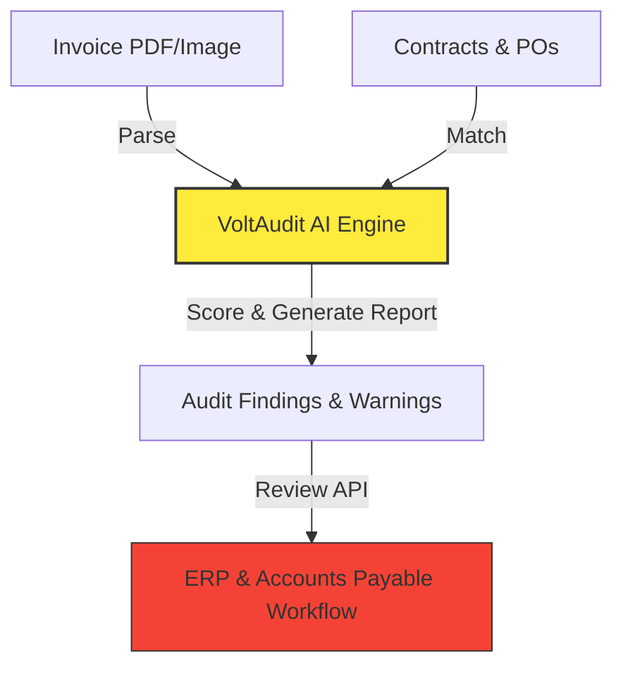

# 🌐 Global Context & Domain Knowledge

This document serves as the project dictionary and glossary. It ensures that both developers and LLM prompts use consistent financial, tax, and system-boundary terminology.

---

## 📖 Glossary of Terms

### 1. Invoice Ingestion & Parsing
- **Invoice:** A commercial document issued by a seller to a buyer, relating to a sale transaction and indicating the products, quantities, and agreed prices.
- **OCR (Optical Character Recognition):** The process of converting scanned images of invoices into machine-readable digital text.
- **Line Item:** An individual row entry in an invoice representing a specific product or service, including description, unit price, quantity, tax rate, and total cost.

### 2. Matching & Audit Logics
- **3-Way Matching:** The auditing procedure of comparing:
  1. The **Invoice** (billed amount).
  2. The **Purchase Order (PO)** (authorized amount).
  3. The **Receiving Report / Goods Receipt** (delivered quantity).
- **Entity Resolution:** The task of identifying and mapping variations of vendor names (e.g., "Google Ireland Ltd.", "Google LLC", "Google") to a single canonical vendor entity in the system.
- **Double Billing / Duplicate Invoices:** A fraudulent or accidental billing pattern where a single delivery is invoiced multiple times, often using minor shifts in invoice numbers (e.g. `INV-909` vs `INV909-A`).

### 3. Tax and Regulatory Auditing
- **VAT (Value Added Tax) / GST (Goods and Services Tax):** Multi-stage consumption taxes. Audits must verify the correct registration numbers are printed and tax calculations match regional rules.
- **W-9 / W-8BEN Validation:** Ensuring US domestic or international vendors have updated tax withholding certificates on file matching the billing details.

---

## 🎛️ System Boundaries & Scope

### What VoltAudit AI DOES:
* **Ingest & Classify:** Ingests document streams (PDFs, TIFFs, JPGs) and classifies them as invoice, credit note, utility bill, or non-billing document.
* **Extraction:** Parses headers, metadata, tax info, and structured item tables.
* **Audit Evaluation:** Runs deterministic code validations and agent-assisted cognitive audits against legal agreements.
* **Reporting:** Highlights anomalies, double billing, incorrect tax, and discrepancies, assigning a risk-compliance score.

### What VoltAudit AI DOES NOT Do (Out of Scope):
* **Payment Processing:** VoltAudit does not interface with banks, clearinghouses, or credit card networks to pay invoices.
* **ERP Ledgers:** It does not directly write journal entries or record financial payments. It reports findings via API to ERP gateways (e.g., SAP, NetSuite) for approval.
* **Manual OCR Correction:** The system scores extraction confidence but does not supply a manual keying portal. High-risk, unparseable files are flagged for human operator review in the ERP.
