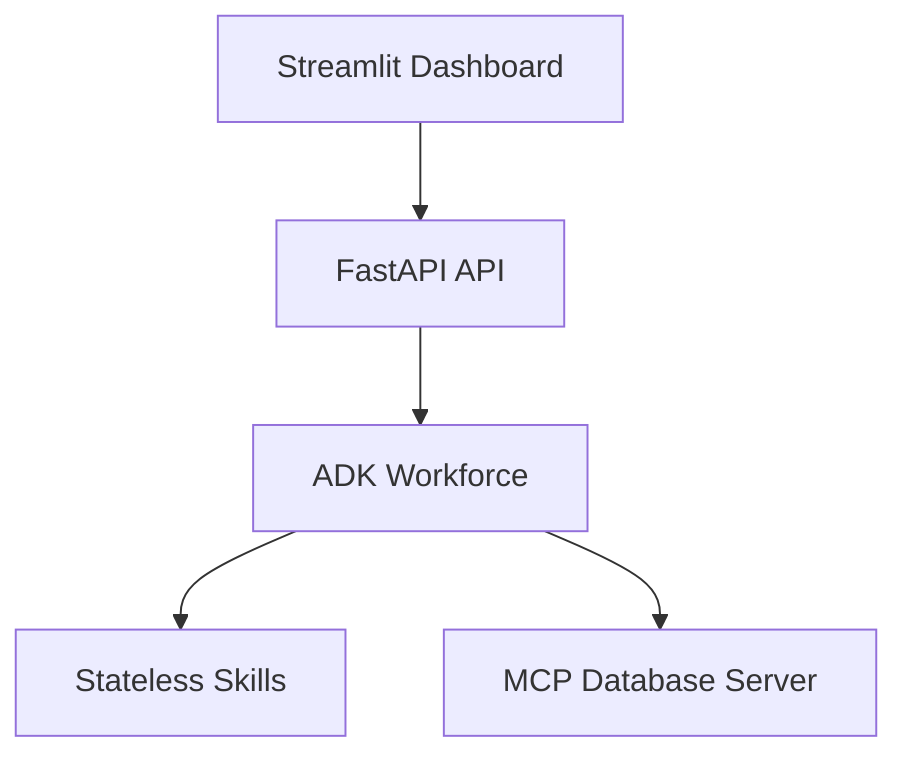

# 🏆 VoltAudit AI: Production-Grade Cooperative Multi-Agent Auditing Platform

## 1. Project Overview & Problem Statement

VoltAudit AI is a production-grade multi-agent auditing platform designed to audit large enterprise utility invoices. Monthly utility expenditures (electricity, water, steam, and gas) in industrial contexts represent millions of dollars in costs, but are subject to multiple errors:
- **Tariff Violations:** Charging peak hour multipliers during off-peak times.
- **Contract Mismatches:** Charging rates higher than supplier agreement maximums.
- **Physical Meter Deviations:** Billing quantities that do not reconcile with actual plant meter readings.
- **Double Billing:** Submitting duplicate runs that bypass traditional ERP checks.

Manual auditing is slow and prone to errors. VoltAudit AI automates this process using **Cooperative AI Agents**, **Model Context Protocol (MCP)**, and **Antigravity Skills**.

---

## 2. Technical Architecture

VoltAudit AI is structured into six decoupled layers:

1. **Presentation Layer:** A premium wide-layout Streamlit dashboard displaying metrics, live agent traces, and override gateways.
2. **Application Layer:** FastAPI backend REST services implementing connection-pool management and transaction tracing.
3. **Agent Orchestration Layer:** The ADK (Agent Development Kit) platform coordinating 8 cooperative specialists.
4. **Skill Layer:** Modular, stateless Python packages (SPK-001 to SPK-009) providing math, fuzzy matching, and parsing.
5. **Model Context Protocol (MCP) Server:** Bounded stdio server providing secure database access.
6. **Infrastructure Layer:** SQLite database containing canonical supplier rates, contract definitions, and plant meter readings.

---

## 3. The Cooperative AI Workforce

VoltAudit AI coordinates **8 specialized agents** acting as a cooperative team:
1. **Coordinator Agent (WRK-001):** Manages sequential pipeline loops, executing specialists step-by-step.
2. **Document Ingestion Specialist (WRK-002):** Extracts text blocks from raw invoices.
3. **Vendor Resolution Specialist (WRK-003):** Matches vendors using fuzzy logic.
4. **Contract Specialist (WRK-004):** Validates invoice dates against contract limits.
5. **Tariff Validation Specialist (WRK-005):** Evaluates peak hours rate multipliers.
6. **Billing & 3-Way Reconciler (WRK-006):** Validates arithmetic subtotals.
7. **Historical Anomaly Specialist (WRK-007):** Scans databases for historical duplicates.
8. **Risk Assessment Specialist (WRK-008):** Calculates risk scorecards.
9. **Audit Reporting Specialist (WRK-008_reporter):** Generates markdown audit reports.

---

## 4. Zero-Trust Security & Bounded Tool Execution (MCP)

To prevent LLMs from writing arbitrary SQL, we implement **Model Context Protocol (MCP)** boundaries. The agents interact with databases exclusively via bounded FastMCP tools:
- **Input Sanitization:** Uploaded paths are checked for traversal patterns (e.g. `../etc/passwd`) before database operations.
- **Parameterized Mappings:** MCP queries utilize SQL parameters exclusively, preventing SQL injections.
- **Explicit Authorization:** Agents possess explicit list configurations (`allowed_mcp_tools`) verified by the ADK platform.

---

## 5. Observability & Telemetry

Observability is integrated at every layer:
- **Correlation IDs:** Middleware injects transaction tracking tokens across requests.
- **Timings & Log traces:** The `@trace_skill` decorator logs execution timings and exceptions as structured JSON to stdout.
- **Audit Logging:** Every step records a trace entry including the agent ID, action performed, and diagnostic metadata.

---

## 6. Evaluation Framework

The platform includes a testing suite verifying correctness:
- **Correctness Scorecard Tests:** Confirms compliance score deductions match pre-defined risk criteria.
- **Orchestration Sequence Tests:** Confirms the Coordinator executes specialists in sequential order.
- **Robustness Tests:** Confirms SQLite databases clean up connections under exceptions to avoid lock contentions.
