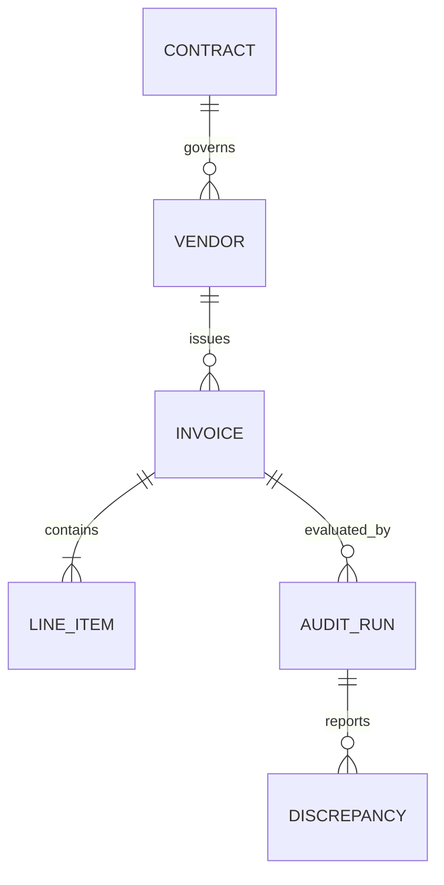

# 📋 VoltAudit AI Product & Technical Specifications

This document defines the functional scope, data schemas, API contracts, and agent interaction patterns for **VoltAudit AI**. Future implementation tasks will build directly upon these specifications.

---

## 1. Functional System Overview

VoltAudit AI operates as an automated financial auditor. It receives invoice documents, parses their metadata, and evaluates them against two primary reference sources:
1. **Contracts Database:** Billed rates, payment terms, and service levels.
2. **Regulatory & Tax Ruleset:** Tax configurations (e.g. VAT rate verification, matching tax numbers).

The auditing cycle produces a risk-scored audit report containing categorized **Discrepancies**.

---

## 2. Core Data Schemas

These tables represent the database models implemented in the backend application.



### Vendor
- `id` (UUID, PK)
- `canonical_name` (String, unique)
- `tax_id` (String)
- `address` (Text)
- `created_at` (DateTime)

### Contract
- `id` (UUID, PK)
- `vendor_id` (UUID, FK)
- `contract_number` (String, unique)
- `effective_date` (Date)
- `expiry_date` (Date)
- `payment_terms_days` (Integer)
- `max_authorized_amount` (Decimal)

### Invoice
- `id` (UUID, PK)
- `vendor_id` (UUID, FK, Nullable)
- `raw_vendor_name` (String)
- `invoice_number` (String)
- `invoice_date` (Date)
- `due_date` (Date)
- `currency` (String)
- `subtotal` (Decimal)
- `tax_amount` (Decimal)
- `total_amount` (Decimal)
- `status` (Enum: `INGESTED`, `PARSED`, `AUDITING`, `AUDITED`, `FAILED`)

### LineItem
- `id` (UUID, PK)
- `invoice_id` (UUID, FK)
- `description` (Text)
- `quantity` (Decimal)
- `unit_price` (Decimal)
- `total_price` (Decimal)
- `tax_rate` (Decimal)

### AuditRun
- `id` (UUID, PK)
- `invoice_id` (UUID, FK)
- `executed_at` (DateTime)
- `compliance_score` (Integer: 0 to 100)
- `outcome` (Enum: `PASSED`, `WARNINGS`, `FAILED`)

### Discrepancy
- `id` (UUID, PK)
- `audit_run_id` (UUID, FK)
- `type` (Enum: `PRICE_MISMATCH`, `QUANTITY_EXCEEDED`, `TAX_INCORRECT`, `DUPLICATE_INVOICE`, `EXPIRED_CONTRACT`)
- `severity` (Enum: `LOW`, `MEDIUM`, `HIGH`)
- `description` (Text)
- `expected_value` (String)
- `actual_value` (String)

---

## 3. API Contract Specifications

All API payloads use JSON. Date fields conform to ISO 8601 (`YYYY-MM-DD`).

### Ingestion API
* **Endpoint:** `POST /api/v1/invoices/ingest`
* **Request Format:** Multipart Form Data
  - `file`: (Binary PDF/PNG/JPG)
  - `metadata`: (JSON string containing upload parameters)
* **Response Format:**
  ```json
  {
    "invoice_id": "7d9b9a67-5421-4f32-841d-b6a4a6b228b3",
    "status": "INGESTED",
    "received_at": "2026-06-30T17:00:00Z"
  }
  ```

### Audit Retrieval API
* **Endpoint:** `GET /api/v1/invoices/{invoice_id}/audit-report`
* **Response Format:**
  ```json
  {
    "invoice_id": "7d9b9a67-5421-4f32-841d-b6a4a6b228b3",
    "audit_run_id": "8c7b8a53-4f99-4d22-bcae-21fa33f2b453",
    "executed_at": "2026-06-30T17:01:00Z",
    "compliance_score": 85,
    "outcome": "WARNINGS",
    "discrepancies": [
      {
        "id": "e4f8d9b1-561b-4322-9988-12cfa5f27c81",
        "type": "PRICE_MISMATCH",
        "severity": "HIGH",
        "description": "Item 'Enterprise Cloud Hosting' unit price $120.00 exceeds contract maximum rate of $100.00.",
        "expected_value": "100.00",
        "actual_value": "120.00"
      }
    ]
  }
  ```

---

## 4. AI Agent Auditing Layer

The reasoning is structured around a **Cognitive Auditor Agent**:
1. **Tool Ingestion:** Queries MCP (Model Context Protocol) to retrieve canonical Contracts and PO records based on the parsed vendor identity.
2. **Context Assembly:** Feeds contract parameters and invoice line items into the prompt.
3. **Audit Execution:** The LLM evaluates if the pricing, quantities, and payment terms match parameters.
4. **Structured Output:** The agent writes structured `Discrepancy` payloads into the backend DB.
